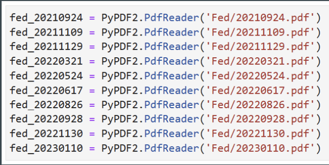

# Welcome to our [team project website!]((https://sikaiwang224.github.io/teamproject-/))

Maybe you want a different website them for the project? Consider `minimal-mistakes`:
1. [Go here](https://github.com/mmistakes/mm-github-pages-starter/generate).
2. In the resulting repo, click Settings, then Pages, then make sure the source is the main branch.
3. [The doc site is here](https://mmistakes.github.io/minimal-mistakes/docs/structure/) and will help you customize layouts and figure out how to use it.

## Table of contents
1. [Introduction](#introduction)
2. [Methodology](#meth)
3. [Section 2](#section2)
    1. [Subsection](#subsec2-1)
    2. [Subsection](#subsec2-2)
4. [Analysis Section](#section3)
5. [Summary](#summary)

## Introduction  <a name="introduction"></a>
The main goal of this project is to see how Federal Reserve announcements impact the stock market in recent 2 years.
Research Question:
How do Federal Reserve announcements influence the stock market according to Natural language processing, particularly the ETFs across various sectors?

Specific research question:
What is the overall sentiment and intensity in the each announcements?
How do these sentiment scores correlate with subsequent stock market movements for the sector ETFs?
Can we predict stock market reactions based on the sentiment derived from announcements?

Hypotheses:
Positive sentiment score in announcements leads to a positive stock market reaction.
Negative sentiment score in announcements leads to a negative stock market reaction.

Predictions:
According to the hypotheses above, we believe that every time when the Federal Reserve announcements related to a piece of good news are released, the stock of companies will show a good trend and vice versa. Whether it has a piece of good news is determined by the sentiment score that we measure.

  

## Methodology <a name="meth"></a>

Here is some code that we used to develop our analysis. Blah Blah. [More details are provided in the Appendix](page2).


```python
window = 10
event_dates = ['2021-09-24', '2021-11-09', '2021-11-29', '2022-03-21', '2022-05-24', '2022-06-17', '2022-08-26', '2022-09-28', '2022-11-30', '2023-01-11']
event_dates = [pd.Timestamp(date) for date in event_dates]
returns['Date'] = pd.to_datetime(returns['Date'])

for event_date in event_dates:
    before_event = returns[returns['Date'] < event_date].tail(window)
    after_event = returns[returns['Date'] > event_date].head(window)

    mean_before = before_event['Return'].mean()
    std_before = before_event['Return'].std()
    mean_after = after_event['Return'].mean()
    std_after = after_event['Return'].std()

    return_mean = (mean_before-mean_after)/mean_before
    return_std = (std_before-std_after)/std_before
    announce_date.loc[announce_date['Date'] == event_date, 'Return_mean'] = return_mean
    announce_date.loc[announce_date['Date'] == event_date, 'Return_Standard_Deviation'] = return_std
    sentiment_score_df['Date'] = pd.to_datetime(sentiment_score_df['Date'])
    merged_df = pd.merge(announce_date, sentiment_score_df, on='Date')
    print(merged_df)
    corr_matrix = merged_df[['Return_mean', 'Return_Standard_Deviation', 'SentimentScore']].corr()
    print(corr_matrix)
```


## ETF tickers <a name="ETFtickers"></a>


### Sentiment scores <a name="sentimentscores"></a>
By analyzing the sentiment score analysis of news articles, social media posts, and other textual data, traders and investors can identify emerging trends, gauge market sentiment, and make more informed investment decisions. Sentiment score analysis is one of the many tools used in fundamental analysis, which involves analyzing the underlying financial and economic factors that affect the stock market.




## Analysis  <a name="Analysis"></a>

Here are some graphs that we created in our analysis. We saved them to the `pics/` subfolder and include them via the usual markdown syntax for pictures.


<br><br>
Some analysis here
<br><br>

<br><br>
More analysis here.
<br><br>

<br><br>

More analysis.


## Summary <a name="summary"></a>

Blah blah


## About the team


<br>
Sikai is a student in Lehigh University majoring in Finance and Business Analytics. I’ve always been fascinated by the world of finance and the role it plays in shaping our economy, which leads me to join IMG and participate in the Analyst Development Program.
<br><br><br>

<br>
Sz-Je Wang is a highly motivated Finance and Business Analytics major with a FinTech minor at Lehigh University, expecting to graduate in May 2024. My academic journey has been fueled by a strong passion for understanding the intricacies of financial markets. 

Xilong Liu is a student at Lehigh University majoring Finance and Consulting Management. I am a passion buisness student who is pursing use data and insight to solve finance problem
## More 

To view the GitHub repo for this website, click [here](https://github.com/donbowen/teamproject).
