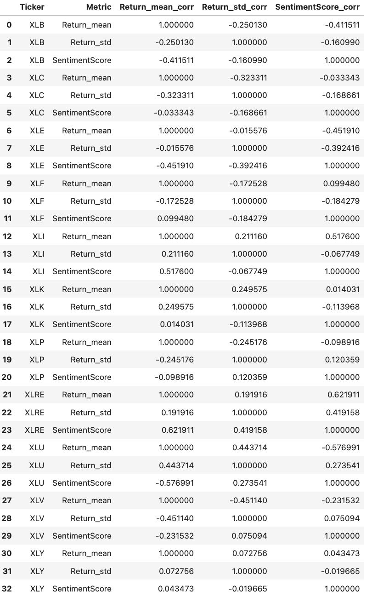

# Welcome to our [team project website!]((https://sikaiwang224.github.io/teamproject-/))
Sentiment Analysis of Federal Reserve Announcements and its Impact on the Sector ETFs

## Table of contents
1. [Introduction](#introduction)
2. [Methodology](#meth)
3. [ETF Tickers](#etftickers)
    1. [Sentiment Scores](#sentimentscores)
4. [Analysis Section](#analysis)
5. [Finding](#finding)
6. [Summary](#summary)

## Introduction  <a name="introduction"></a>
The main goal of this project is to see how Federal Reserve announcements impact the stock market in recent 2 years.
Research Question:
How do Federal Reserve announcements influence the stock market according to Natural language processing, particularly the ETFs across various sectors?

### Specific research question:
- What is the overall sentiment and intensity in the each announcements?
- How do these sentiment scores correlate with subsequent stock market movements for the sector ETFs?
- Can we predict stock market reactions based on the sentiment derived from announcements?

### Our Hypotheses:
- Positive sentiment score in announcements leads to a positive stock market reaction.
- Negative sentiment score in announcements leads to a negative stock market reaction.

### Predictions:
According to the hypotheses above, we believe that every time when the Federal Reserve announcements related to a piece of good news are released, the stock of companies will show a good trend and vice versa. Whether it has a piece of good news is determined by the sentiment score that we measure.

  

## Methodology <a name="meth"></a>

In this project, we perform sentiment analysis on the Federal Reserve announcements using natural language processing to obtain sentiment scores. We then merge these sentiment scores with the corresponding stock and ETF returns to analyze the correlation between the sentiment scores and stock market movements. This analysis allows us to gain insights into the influence of Federal Reserve announcements on the stock market, particularly the ETFs across various sectors.
[More details are provided in the Appendix](page2).


```python
window = 10
event_dates = ['2021-09-24', '2021-11-09', '2021-11-29', '2022-03-21', '2022-05-24', '2022-06-17', '2022-08-26', '2022-09-28', '2022-11-30', '2023-01-11']
event_dates = [pd.Timestamp(date) for date in event_dates]
returns['Date'] = pd.to_datetime(returns['Date'])

for event_date in event_dates:
    before_event = returns[returns['Date'] < event_date].tail(window)
    after_event = returns[returns['Date'] > event_date].head(window)

    mean_before = before_event['Return'].mean()
    std_before = before_event['Return'].std()
    mean_after = after_event['Return'].mean()
    std_after = after_event['Return'].std()

    return_mean = (mean_before-mean_after)/mean_before
    return_std = (std_before-std_after)/std_before
    announce_date.loc[announce_date['Date'] == event_date, 'Return_mean'] = return_mean
    announce_date.loc[announce_date['Date'] == event_date, 'Return_Standard_Deviation'] = return_std
    sentiment_score_df['Date'] = pd.to_datetime(sentiment_score_df['Date'])
    merged_df = pd.merge(announce_date, sentiment_score_df, on='Date')
    print(merged_df)
    corr_matrix = merged_df[['Return_mean', 'Return_Standard_Deviation', 'SentimentScore']].corr()
    print(corr_matrix)
```


## ETF Tickers <a name="etftickers"></a>


- Financials: Financial Select Sector SPDR Fund (XLF)
- Technology: Technology Select Sector SPDR Fund (XLK)
- Healthcare: Health Care Select Sector SPDR Fund (XLV)
- Consumer Discretionary: Consumer Discretionary Select Sector SPDR Fund (XLY)
- Consumer Staples: Consumer Staples Select Sector SPDR Fund (XLP)
- Industrials: Industrial Select Sector SPDR Fund (XLI)
- Energy: Energy Select Sector SPDR Fund (XLE)
- Materials: Materials Select Sector SPDR Fund (XLB)
- Utilities: Utilities Select Sector SPDR Fund (XLU)
- Real Estate: Real Estate Select Sector SPDR Fund (XLRE)
- Communication Services: Communication Services Select Sector SPDR Fund (XLC)


### Sentiment scores <a name="sentimentscores"></a>
By analyzing the sentiment score analysis of news articles, social media posts, and other textual data, traders and investors can identify emerging trends, gauge market sentiment, and make more informed investment decisions. Sentiment score analysis is one of the many tools used in fundamental analysis, which involves analyzing the underlying financial and economic factors that affect the stock market.




## Analysis  <a name="analysis"></a>
Our analysis involves examining the correlation between the sentiment scores derived from the Federal Reserve announcements and the subsequent stock market movements for the sector ETFs. By identifying the trends in these correlations, we can better understand the impact of Federal Reserve announcements on the stock market and make more informed predictions about stock market reactions based on the sentiment derived from announcements.


## Visulizations 
The visualizations in this project showcase the relationships between sentiment scores and stock market movements. We provide a series of graphs that help illustrate the trends and correlations between sentiment scores derived from the Federal Reserve announcements and the stock and ETF returns. These visualizations serve as a valuable tool in understanding the impact of Federal Reserve announcements on the stock market.


<br><br>
<br><br>

<br><br>
<br><br>

<br><br>

## Finding  <a name="finding"></a>
- One notable finding in our research is based on the 2022-11-30 Chairman Powell speech announcement. During the announcement, Chairman Powell discussed the possibility of slowing down interest rate hikes as early as the December meeting and considering the duration of maintaining restrictive interest rates to curb inflation. 
- Our sentiment analysis resulted in a score of 28, indicating that it was a positive announcement. We compared the returns of four different sectors, such as utilities (XLU), materials (XLB), financials (XLF), and healthcare (XLV), during the announcement period. We discovered that the utilities sector had the highest return, while the healthcare sector had the lowest return.

- As a result of our sentiment analysis, we can conclude that the Federal Reserve announcement has benefited the utilities sector while causing harm to the healthcare sector. 

## Summary <a name="summary"></a>

Overall, this final project  involves the use of machine learning algorithms to analyze news articles, social media posts and other text data to determine the sentiment of market participants regarding Fed announcements. Sentiment score analysis assigns a score to each text segment based on its positive, negative or neutral sentiment.

Also,The impact on sector etfs is analyzed by examining the price movements of etfs focused on specific economic sectors (e.g., technology, health care or energy) following the Fed announcement. The purpose of the analysis is to determine whether market participants' sentiment toward the announcement is positively or negatively correlated with the price movement of sector etfs. Finally,the sentiment analysis results of Fed announcements and their subsequent impact on sector etfs can provide valuable insights for traders and investors to make informed investment decisions. By understanding market participants' sentiment towards the Fed announcement and its impact on sector etfs, traders and investors can adjust their investment strategies and manage their exposures accordingly


## About the team


<br>
Sikai is a student in Lehigh University majoring in Finance and Business Analytics. I’ve always been fascinated by the world of finance and the role it plays in shaping our economy, which leads me to join IMG and participate in the Analyst Development Program.
<br><br><br>

<br>
Sz-Je Wang is a highly motivated Finance and Business Analytics major with a FinTech minor at Lehigh University, expecting to graduate in May 2024. My academic journey has been fueled by a strong passion for understanding the intricacies of financial markets. 

Xilong Liu is a student at Lehigh University majoring Finance and Consulting Management. I am a passion buisness student who is pursing use data and insight to solve finance problem


To view the GitHub repo for this website, click [here](https://github.com/SikaiWang224/teamproject-).
